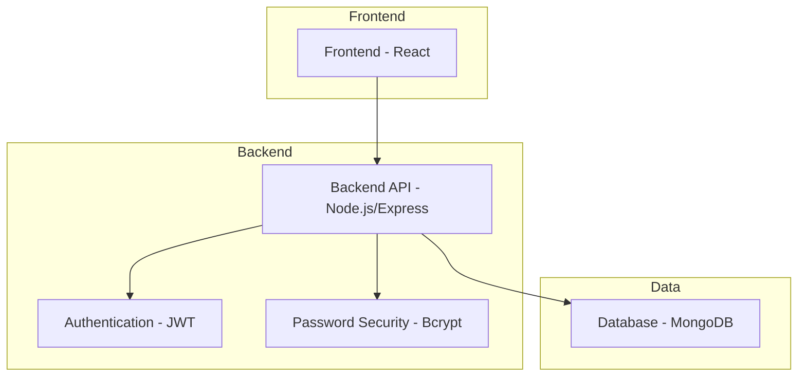

# College Student Portal Architecture

## System Overview

## Component Details

### Frontend (React)
- Built with React and TypeScript
- Uses styled-components for styling
- Responsive design with dark/light mode
- Components:
  - Login/Signup
  - Dashboard
  - Course Materials
  - Research Resources
  - Quizzes
  - Grade Calculator
  - Discussion Forum
  - Event Calendar
  - Workshops
  - Gallery
  - Timetable Generator
  - Portfolio Builder

### Backend (Node.js/Express)
- RESTful API
- User authentication with JWT
- Password hashing with Bcrypt
- MongoDB integration with Mongoose
- CORS enabled for frontend communication

### Database (MongoDB)
- User collection
- Course materials collection
- Research resources collection
- Quiz data collection
- Grade data collection
- Forum posts collection
- Event calendar collection
- Workshop information collection
- Gallery media collection
- Timetable data collection
- Portfolio data collection

## Data Flow

1. User accesses the React frontend
2. Frontend makes API calls to the Node.js backend
3. Backend authenticates requests using JWT
4. Backend processes requests and interacts with MongoDB
5. Data is returned to the frontend for display

## Security Features

- Password hashing with Bcrypt
- JWT-based authentication
- CORS protection
- Input validation
- Environment-based configuration